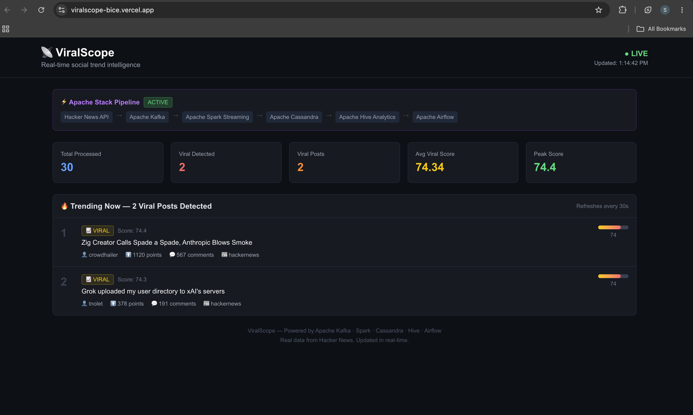

# 📡 ViralScope

> Real-time social trend intelligence — detects viral content before it goes mainstream.

**Live Demo:** https://viralscope-bice.vercel.app  
**Backend API:** https://viralscope-api.onrender.com  
**Stack:** Apache Kafka · Apache Spark · Apache Cassandra · Apache Hive · Apache Airflow · FastAPI · Next.js

---

## What It Does

ViralScope is a real-time social trend intelligence pipeline that ingests live posts from Hacker News, detects viral content using a scoring algorithm, and serves trending topics on a live dashboard — all powered by the Apache ecosystem.

**Live right now:**
- "Zig Creator Calls Spade a Spade, Anthropic Blows Smoke" — score 1120, viral score 74.4
- "Grok uploaded my user directory to xAI's servers" — score 378, viral score 74.3

---

## Architecture
```
Hacker News API (real-time posts)
↓
┌─────────────────────────┐
│  Apache Kafka           │  Event streaming — posts published to viralscope_posts topic
│  kafka/producer.py      │  Fetches 30 posts/batch, computes viral score, streams to Kafka
└───────────┬─────────────┘
↓
┌─────────────────────────┐
│  Apache Spark Streaming │  Micro-batch processing every 15 seconds
│  spark/stream_processor │  Reads from Kafka, parses JSON, detects viral posts
│                         │  Writes to Cassandra via foreachBatch
└───────────┬─────────────┘
↓
┌─────────────────────────┐
│  Apache Cassandra       │  Low-latency NoSQL storage
│  Tables: viral_posts,   │  Stores viral posts + pipeline stats
│  pipeline_stats         │  Optimized for time-series reads
└───────────┬─────────────┘
↓
┌─────────────────────────┐
│  Apache Hive            │  Analytical queries on processed data
│  hive/analytics.py      │  Viral score distribution, top authors,
│                         │  trending topics, hourly aggregations
└───────────┬─────────────┘
↓
┌─────────────────────────┐
│  Apache Airflow         │  Pipeline orchestration
│  airflow/dags/          │  Hourly DAG: fetch → kafka check →
│  viralscope_pipeline.py │  cassandra check → trend report
└───────────┬─────────────┘
↓
┌─────────────────────────┐
│  FastAPI + Next.js      │  Live dashboard
│  dashboard/api.py       │  Serves viral posts, stats, pipeline status
│  frontend/              │  Dark-theme UI, refreshes every 30 seconds
└─────────────────────────┘
```
---

## Viral Score Algorithm

```python
def calculate_viral_score(post):
    score = post["score"]
    comments = post["comments"]
    age_hours = (now - post["unix_time"]) / 3600
    
    # HN-style decay: newer + more engagement = higher score
    viral_score = (score + comments * 2) / (age_hours + 2) ** 1.5
    return viral_score

# Threshold: viral_score > 50 = VIRAL
```

Posts are classified as viral when their engagement velocity exceeds the decay threshold — the same principle behind Hacker News's own ranking algorithm.

---

## Apache Stack

| Tool | Role | Version |
|------|------|---------|
| **Apache Kafka** | Event streaming — ingests post events | 7.4.0 |
| **Apache Spark** | Stream processing — detects viral content | 3.4.1 |
| **Apache Cassandra** | NoSQL storage — serves real-time reads | 4.1 |
| **Apache Hive** | Analytics — SQL queries on processed data | via PySpark SQL |
| **Apache Airflow** | Orchestration — hourly pipeline scheduling | 2.7.0 |

---

## Live Dashboard

The dashboard updates every 30 seconds with real data from the pipeline. Each viral post shows:

- **Viral Score** — engagement velocity score computed by the Kafka producer (higher = spreading faster)
- **Points** — raw Hacker News upvote score
- **Comments** — discussion volume (weighted 2x in viral score because comments signal deeper engagement)
- **Apache Stack Pipeline banner** — shows the live status of all 6 Apache tools in the pipeline
- **Stats cards** — total posts processed by Spark, viral posts detected, average and peak viral scores

A post crosses the viral threshold (score > 50) when its engagement velocity outpaces its age decay — the same principle behind Hacker News's own ranking algorithm.



---

## Running Locally

```bash
# 1. Clone
git clone https://github.com/Sakshi3027/viralscope.git
cd viralscope

# 2. Install dependencies
pip install -r requirements.txt

# 3. Start Apache services (Docker)
docker-compose up -d zookeeper kafka cassandra

# 4. Run pipeline (3 terminals)
python3 kafka/producer.py          # Terminal 1: Kafka producer
python3 spark/stream_processor.py  # Terminal 2: Spark streaming
python3 hive/analytics.py          # Terminal 3: Hive analytics

# 5. Start API
uvicorn dashboard.api:app --port 8083

# 6. Start frontend
cd frontend && npm run dev

# 7. Start Airflow (optional)
docker-compose up -d airflow
# Open http://localhost:8082
```

---

## Project Structure
```
viralscope/
├── kafka/
│   └── producer.py              # Hacker News → Kafka producer
├── spark/
│   └── stream_processor.py      # Spark Streaming → Cassandra
├── hive/
│   ├── analytics.py             # Hive-style analytical queries
│   └── schema.sql               # Hive table definitions
├── airflow/
│   └── dags/
│       └── viralscope_pipeline.py  # Hourly Airflow DAG
├── dashboard/
│   └── api.py                   # FastAPI backend
├── frontend/                    # Next.js live dashboard
├── data/
│   ├── trending.json            # Pre-computed viral posts
│   └── stats.json               # Pipeline statistics
└── docker-compose.yml           # All Apache services
```
---

## API Endpoints

| Endpoint | Description |
|----------|-------------|
| `/trending` | Top viral posts with scores |
| `/stats` | Pipeline statistics |
| `/health` | Health check |

---

Built by [Sakshi Chavan](https://github.com/Sakshi3027) · MS Data Science @UMass  
AI Engineer · Data Engineer · Apache ecosystem · Actively interviewing
